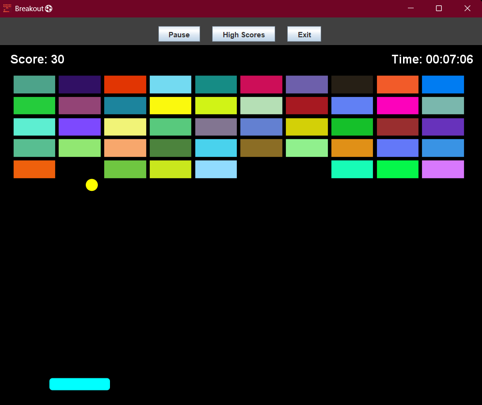

# Breakout Game Java

A classic Breakout game implemented in Java using Swing for the graphical user interface. The game features a paddle, ball, bricks, scoring system, timer, pause/play functionality, and high scores stored in a MySQL database.



## Features

- **Classic Gameplay**: Control the paddle to bounce the ball and break all bricks.
- **Scoring System**: Earn points for each brick destroyed.
- **Timer**: Track your playtime with a built-in timer.
- **Pause/Play**: Pause and resume the game at any time.
- **High Scores**: Save and view high scores in a MySQL database.
- **Responsive Controls**: Use keyboard or mouse to control the paddle.

## Libraries and Dependencies

- **Java Swing**: Built-in Java library for GUI components.
- **MySQL Connector/J** (mysql-connector-j-9.5.0.jar): JDBC driver for MySQL database connectivity.
- **java-dotenv** (java-dotenv-5.2.2.jar): Library for loading environment variables from a .env file.
- **Kotlin Standard Library** (kotlin-stdlib-1.9.10.jar): Dependency for java-dotenv.

## Prerequisites

- **Java**: JDK 8 or higher installed on your system.
- **MySQL**: MySQL server installed and running.
- **Git**: For cloning the repository.

## Setup Instructions

1. **Clone the Repository**:
   ```
   git clone <repository-url>
   cd OOM_Java_Breakout
   ```

2. **Set up MySQL Database**:
   - Create a MySQL database for the game.
   - Create a `.env` file in the root directory with your database credentials:
     ```
     DB_URL=jdbc:mysql://localhost:3306/your_database_name
     USER=your_mysql_username
     PASS=your_mysql_password
     ```
   - Replace `your_database_name`, `your_mysql_username`, and `your_mysql_password` with your actual MySQL details.

3. **Ensure JAR Dependencies**:
   - The required JAR files should be present in the project root:
     - `mysql-connector-j-9.5.0.jar`
     - `java-dotenv-5.2.2.jar`
     - `kotlin-stdlib-1.9.10.jar`

## How to Run

1. **Compile the Java Files**:
   ```
   javac -cp "mysql-connector-j-9.5.0.jar;java-dotenv-5.2.2.jar;kotlin-stdlib-1.9.10.jar" *.java
   ```

2. **Run the Application**:
   ```
   java -cp ".;mysql-connector-j-9.5.0.jar;java-dotenv-5.2.2.jar;kotlin-stdlib-1.9.10.jar" Main
   ```

   - On Windows, use semicolons (`;`) in the classpath.
   - On Unix-like systems (Linux/Mac), use colons (`:`) instead.

## Additional Notes

- The database table `highscores` will be created automatically if it doesn't exist when the application starts.
- If the database connection fails, the game will still run but high scores functionality will be disabled.
- Use the spacebar or click the "Pause" button to pause/resume the game.
- The game window is resizable, and the paddle can be controlled with the left and right arrow keys.

## License

This project is licensed under the terms specified in the LICENSE file.
